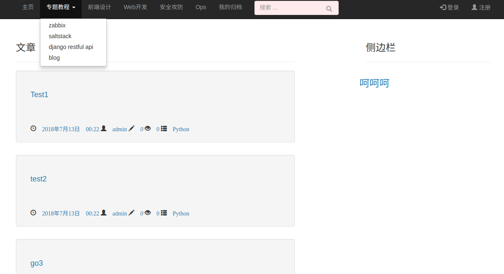
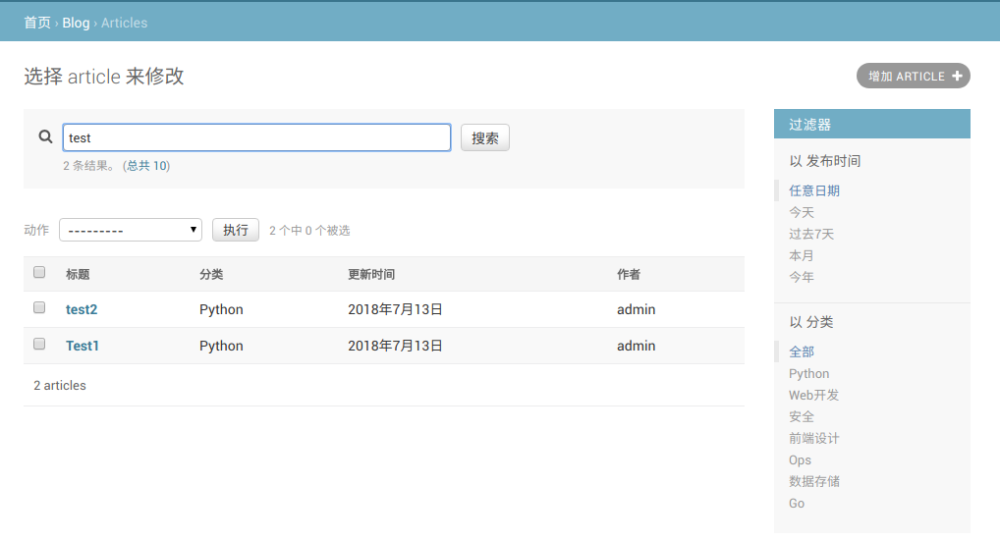

##  LJblog - 个人博客


### 安装环境
django2.0 + bootstrap3.3.7 + markdown


### 初始化环境
```
cd LJblog
python3 -m venv env_django (或: virtualenv -p `which  python3` env_django)
source  env_django/bin/activate
#载入py环境

pip  install -i http://mirrors.aliyun.com/pypi/simple  --trusted-host mirrors.aliyun.com  -r requirements.txt
#安装pip包(阿里源)

python manage.py makemigrations 
#为改动models创建迁移记录
python manage.py migrate 
#同步数据库
python manage.py  createsuperuser
#建立后台管理员帐号

python manage.py runserver
#启动服务
```

### 导入数据
```
python manage.py loaddata  dump_blog.json
#导入文章内容（测试）
# python manage.py dumpdata >  dump_blog.json #导出
```


### 效果预览

图1：


图2：

