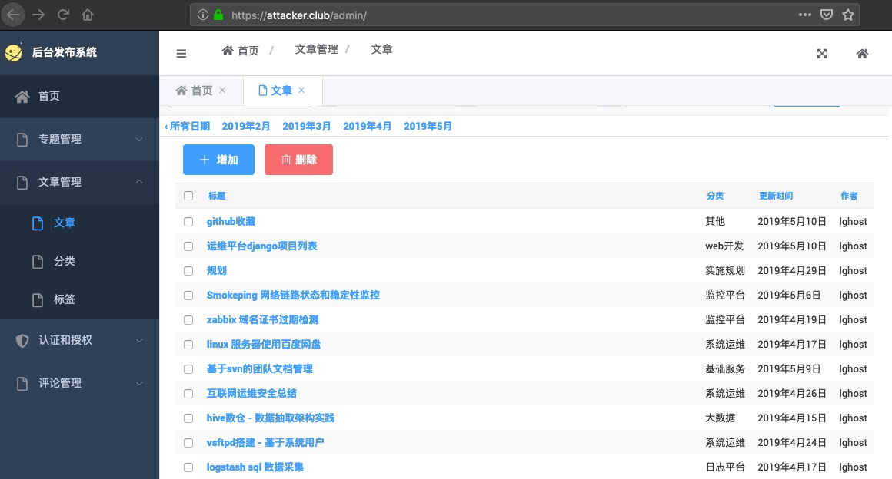

##  LJblog - 个人博客


### 环境


### 初始化环境
```
cd LJblog
python3 -m venv env_django (或: virtualenv -p `which  python3` env_django)
source  env_django/bin/activate
#载入py环境

pip  install -i http://mirrors.aliyun.com/pypi/simple  --trusted-host mirrors.aliyun.com  -r requirements.txt
#安装pip包(阿里源)

python manage.py makemigrations 
#为改动models创建迁移记录
python manage.py migrate 
#同步数据库
python manage.py  createsuperuser
#建立后台管理员帐号

python manage.py runserver
#启动服务
```

### 维护调试
**数据导入和导出**
```
python manage.py dumpdata >  dump_blog.json 
#导出文章内容
python manage.py loaddata  dump_blog.json
#导入内容
```


### 效果预览

首页:


文章发布图：



### demo:
[https://attacker.club/](https://attacker.club/ "https://attacker.club/")