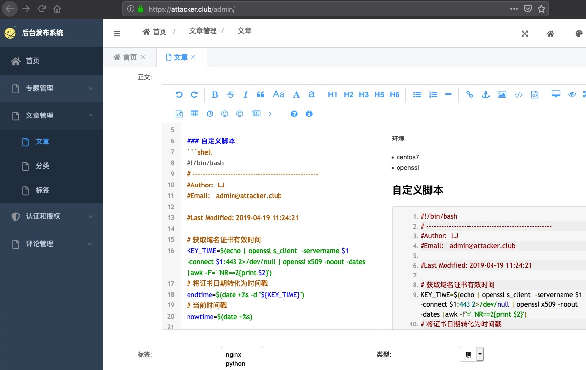

##  LJblog - 个人博客


### 环境


### 初始化环境
```
cd LJblog
echo env_django >> .gitignore # 排除env环境上传至git
python3 -m venv env_django (或: virtualenv -p `which  python2.7` env_django) 
# 创建env
source  env_django/bin/activate #载入py环境

pip  install -i http://mirrors.aliyun.com/pypi/simple  --trusted-host mirrors.aliyun.com  -r requirements.txt
#安装pip包(阿里源)

```
### DB数据库配置
```
# sqlite3:
DATABASES = {
    'default': {
        'ENGINE': 'django.db.backends.sqlite3',
        'NAME': os.path.join(BASE_DIR, 'db.sqlite3'),
    }
}

# mysql:
DATABASES = {
    'default': {
        'ENGINE': 'django.db.backends.mysql',
        'NAME': 'blog',
        'USER':'root',
        'PASSWORD':'',
        'HOST':'localhost',
        'PORT':'3306',
    }
}

```
### 初始化数据并并启动
```
python manage.py makemigrations 
# 为改动models创建迁移记录
python manage.py migrate 
# 同步数据库
python manage.py  createsuperuser
# 建立后台管理员帐号

python manage.py collectstatic
# 收集静态资源
python manage.py rebuild_index
# 创建博客index索引

python manage.py runserver
#启动服务
```

### 维护调试
**django shell**
```
from blog.models import Article,Category,Tag 
# 文章
from topic.models import *
# 专题

Article.objects.all()
# 文章
[tag for tag in Tag.objects.all()]
# Tags


topic_indexes = {}
topic_all = Topic.objects.all()
for t in topic_all:
     k =  [ i.pk  for i in Post.objects.filter(topic=t.pk)[:1]]
     topic_indexes[k[0]] = t.name
     topic_indexes.items()

```

**数据导入和导出**
```
python manage.py dumpdata >  dump_.json 
#导出文章内容
python manage.py loaddata  dump_.json
#导入内容
```


### 效果预览

首页:

专题


文章发布图：




### demo:
[https://attacker.club/](https://attacker.club/ "https://attacker.club/")